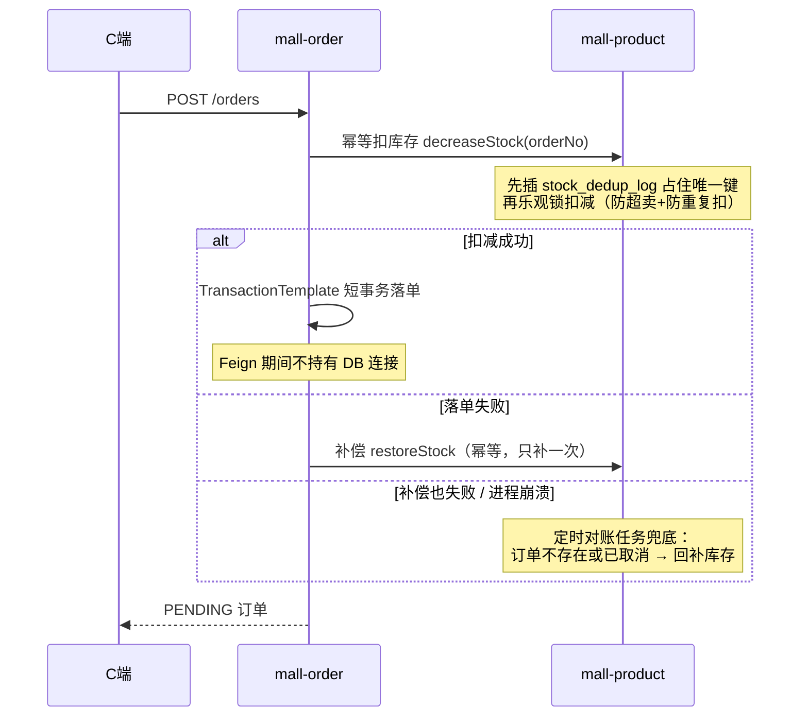
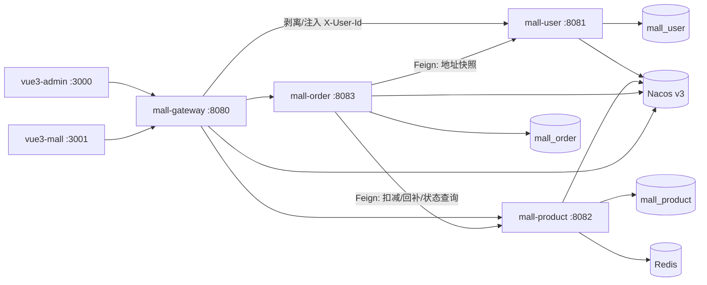

# Mall-Consistency-Lab

[](https://github.com/lark5480/mall-consistency-lab/actions/workflows/ci.yml)
[](LICENSE)

一个以**跨服务数据一致性为核心设计目标**的 Spring Cloud 微服务电商系统：不借助 Seata/MQ 等框架黑盒，手写实现「下单远程扣库存 → 本地落单 → 失败补偿 → 定时对账」的完整 Saga 闭环，并用并发集成测试验证。包含网关鉴权、用户、商品、订单全链路 + B/C 两端前端 + CI + OpenAPI 契约。

> 定位说明：这是学习/简历项目。它的价值不在功能广度，而在于**每个一致性决策都写得出为什么**——见 [docs/DECISIONS.md](docs/DECISIONS.md)（40+ 条带备选方案与理由的决策记录）与 [docs/CONSISTENCY.md](docs/CONSISTENCY.md)（六道防线逐条对应到代码行）；与 GitHub 现存 mall 项目的差异化声明见 [docs/ECOSYSTEM.md](docs/ECOSYSTEM.md)。

## 核心设计：没有 Seata，凭什么数据不会乱

下单链路跨三个服务（order 扣 product 库存、落 order 库、查 user 地址），没有引入分布式事务框架，靠六道防线保证最终一致：



六道防线：**① 库存乐观锁防超卖 → ② 去重表幂等（唯一键先行仲裁）→ ③ 短事务（编程式事务圈住落库）→ ④ 同步补偿 → ⑤ 定时对账兜底（按订单状态回补）→ ⑥ 状态机 CAS（条件更新杜绝丢失更新）**。取消订单采用「先 CAS 落终态、再尽力回补」，消除支付/取消并发竞态下的 phantom 库存。

这些设计经过了两轮独立 Code Review 并修复了评审发现的两个一致性 bug（幂等吞异常双重扣库存、取消回补竞态），修复过程见 [docs/CODE_REVIEW.md](docs/CODE_REVIEW.md) 的 v2 复核记录。

## 测试矩阵

| 层级 | 数量 | 覆盖 |
|---|---|---|
| 单元测试（Mockito） | 59 例 | Saga 各分支：扣减/补偿/不确定结果/状态机 CAS 冲突/越权/自动完成冲突跳过 |
| 集成测试（Testcontainers，真实 MySQL + Redis） | 4 例 | **同单号 16 线程并发扣减只扣一次**、8 线程并发回补幂等、对账孤儿回补/正常订单不误补、事务提交后缓存失效 |

集成测试直接复现两个 P0 bug 的并发场景，是修复的回归防线。本地无 Docker 自动跳过；CI（ubuntu runner）真实执行。

另有**混沌测试**（手动执行）：`bash scripts/chaos-test.sh` 在下单流量中随机 `docker kill` order-service，验证对账任务把「已扣库存未落单」的孤儿全部回补、库存台账守恒——进程级故障下的最终一致性可重复证明，记录见 [docs/ACCEPTANCE.md](docs/ACCEPTANCE.md)。

```bash
mvn -B test    # 全部测试；无 Docker 时集成层自动 skip
```

## 技术栈

| 层级 | 技术 |
|---|---|
| 语言 / 运行时 | Java 21 |
| 框架 | Spring Boot 3.5.16 + Spring Cloud 2025.0.3 + Spring Cloud Alibaba 2025.0.0.0 |
| 数据访问 | MyBatis-Plus 3.5.17（乐观锁 + 分页拦截器） |
| 认证 | JWT（jjwt 0.12.7，HS256；密钥环境变量注入、缺失即启动失败） |
| 存储 | MySQL 8.0.36（三库分库）、Redis 7.2（商品缓存）、Nacos Server v3.0.3（服务发现） |
| 前端 | Vue 3.4 + Vite 5.2 + TypeScript（B 端 Element Plus / C 端 Vant，pnpm monorepo + 共享类型包） |
| 测试 | JUnit 5 + Mockito + Testcontainers 1.2x |
| 部署 / CI | Docker Compose（6 服务编排 + 健康检查依赖链）、GitHub Actions |

> 版本组合依据 SCA 官方适配矩阵：Spring Cloud Alibaba 2025.0.0.0 → Spring Cloud 2025.0.x → Spring Boot 3.5.x（nacos-client 3.0.3 ↔ nacos-server v3.0.3）。

## 架构



安全要点：网关统一剥离外部伪造的 `X-User-Id` 再注入鉴权后的可信值、转发前移除 `Authorization`；`/internal/**` 服务间接口不经网关路由；管理接口在网关强制 ADMIN。

## 快速启动

### Docker Compose

```bash
make build
make up
```

> 本机 6379 已被其他 Redis 占用时：`REDIS_HOST_PORT=16379 make up`（Windows PowerShell 用 `$env:REDIS_HOST_PORT="16379"`）覆盖宿主机映射，容器网络内仍为 6379，服务间访问不受影响。

访问入口：
- 网关：<http://localhost:8080>
- B 端：<http://localhost:3000>（演示管理员 `admin / admin123`；看板/商品/分类/订单管理）
- C 端：<http://localhost:3001>（首页/我的订单/我的：资料·改密·地址簿）

> Compose 中数据库密码与 JWT Secret 仅用于本地演示，生产环境必须通过受控密钥注入并替换。
>
> 旧数据卷需执行一次 `docs/sql/zz-migration-v1.4.sql`（可重复执行）：补 order 与 stock_dedup_log 高频查询索引；全新卷自动生效。历史迁移：v1.3（图片快照回填）、v1.1/v1.2（角色列/管理员/地址表/收货人快照）见同目录 `zz-migration-v1.*.sql`。

### 本地开发

```bash
# 后端裸跑必须显式提供 JWT_SECRET（缺失时服务启动即失败，不再有内置默认密钥）；
# compose 方式（docker compose up）已自动注入，无需手动设置
export JWT_SECRET=local-demo-jwt-secret-change-me-1234567890
mvn spring-boot:run -pl mall-user
mvn spring-boot:run -pl mall-product
mvn spring-boot:run -pl mall-order
mvn spring-boot:run -pl mall-gateway

cd mall-consistency-lab-frontend
pnpm install
pnpm --filter @mall/vue3-admin dev
pnpm --filter @mall/vue3-mall dev
```

## 设计取舍（为什么"不用"也是一种方案）

| 决策 | 理由（详见 DECISIONS.md / CONSISTENCY.md） |
|---|---|
| 不用 Seata | 跨服务写操作只有「扣库存」一处，幂等+补偿+对账已构成闭环；Seata AT 需要每个参与方建 undo_log 且全局锁拖吞吐，为单一写场景引入整套框架不成比例 |
| 不用 MQ | 下单必须同步确认实时库存（异步化会出现"下单成功但库存未扣"窗口）；扣库存接口刻意不重试（盲目重试可能超卖），超时走「查状态再决策」而非盲目补偿 |
| 程序员式幂等而非 Redis SETNX | DB 唯一键是并发唯一性的可靠裁判，重启后语义不丢失；Redis 预扣适合秒杀场景（见作者另一项目 flash-sale），常规交易链路同步更简单可解释 |
| 定时任务不加分布式锁 | 单实例部署假设已文档化；重复执行不破坏正确性（CAS + 幂等兜底），扩多实例前引入 ShedLock 即可 |

## 目录结构

```text
docs/CONSISTENCY.md     跨服务一致性与并发设计（六道防线逐条对应代码位置）
docs/DECISIONS.md       40+ 条决策记录（决策/备选/理由）
docs/CODE_REVIEW.md     两轮 Code Review 报告（v2 含 Agent Teams 复核与修复记录）
docs/api-contracts      OpenAPI 3.0 契约（5 份）
docs/sql                三库初始化 SQL + 幂等迁移脚本
mall-common             Result/JWT(启动 fail-fast)/异常公共模块
mall-gateway            Spring Cloud Gateway（鉴权/白名单/CORS）
mall-user               用户服务
mall-product            商品服务（库存一致性核心 + 对账任务）
mall-order              订单服务（Saga 编排 + 状态机）
mall-consistency-lab-frontend  pnpm workspace（B/C 两端 + 共享 TS 类型包）
.github/workflows       CI（后端测试含 Testcontainers / 前端构建 / 镜像构建）
```

## 简化边界

| 项 | 决策 |
|---|---|
| 支付 | **模拟支付**：创建订单后 status=PENDING；提供模拟支付接口 `POST /api/v1/orders/{orderNo}/pay` 将其置为 PAID。不接任何真实支付。 |
| 收货地址 | **v1.2 起为真实服务**：mall_user 库 address 表 + CRUD API；下单时由 order 服务经内部接口固化收货人快照到订单表，跨库不做 join。 |
| Redis | 仅用于一处：product-service 缓存商品详情，TTL 10 分钟，商品修改/删除/库存变动时主动失效（事务提交后执行）。 |
| 购物车 / 优惠券 / 物流 | 本期不做。发货仅流转状态（PAID→SHIPPED），不填物流单号。 |
| 订单取消 | PENDING 订单可取消：先 CAS 落 CANCELLED 再幂等回补库存；失败由对账任务兜底；不做超时自动关单（已知边界，见 CONSISTENCY.md）。 |
| 角色权限 | 区分 USER/ADMIN：注册默认 USER；网关强制校验 `POST/PUT/DELETE /api/v1/products/**` 与**全部 `/api/v1/admin/**`** 必须 ADMIN。种子管理员 admin/admin123 仅本地演示。 |
| 订单状态 | PENDING→PAID→SHIPPED→COMPLETED 与 PENDING→CANCELLED；全部流转经状态机 CAS。 |
