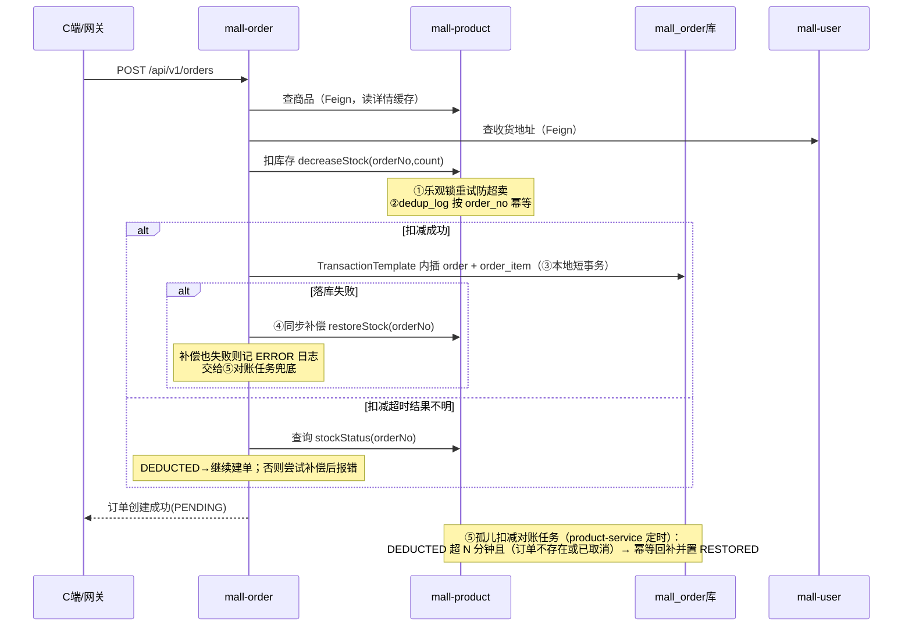
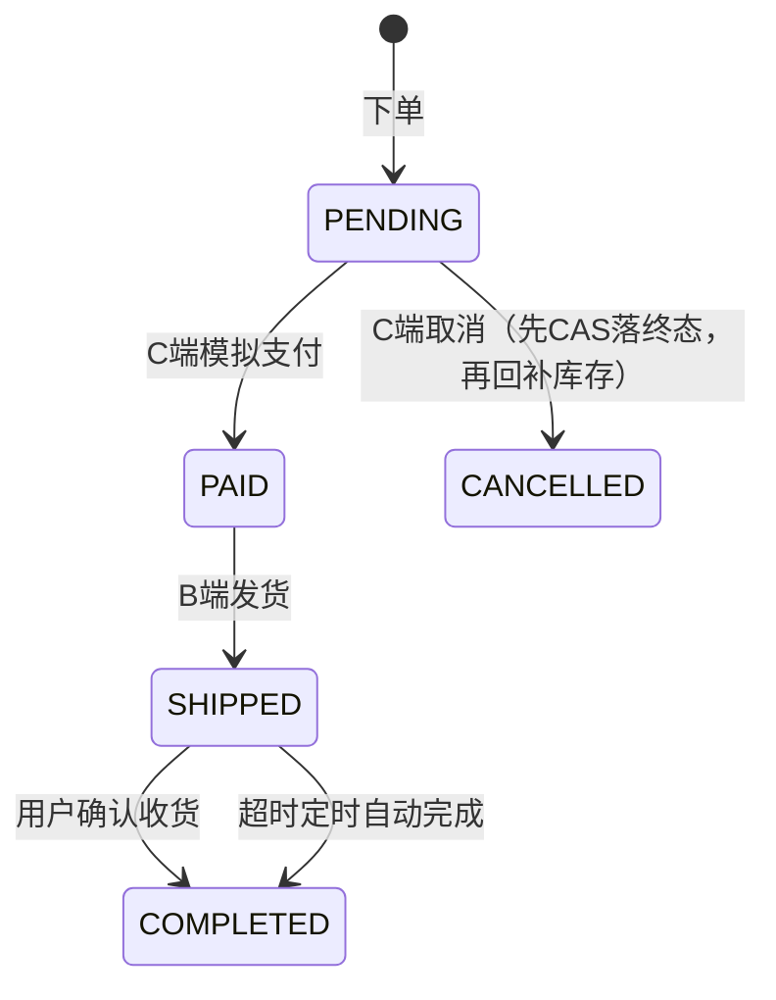

# 跨服务一致性与并发控制设计

> 本文回答一个问题：**下单链路跨了三个服务、没有引入 Seata，凭什么数据不会乱？**
> 答案是六道防线：库存侧乐观锁防超卖 + 去重表幂等 + 本地短事务 + 同步补偿 + 定时对账兜底 + 状态机 CAS 防竞态。
> 每一道都标注了精确的代码位置，均可通过单测或 E2E 手工步骤复现验证。

## 1. 总览

### 下单链路（Saga：远程扣减 → 本地落库 → 失败补偿 → 异步对账）

### 订单状态机（全部流转经 ⑥CAS 条件更新）

非法流转一律返回 `ORDER_STATE_ERROR`（code=40002 / HTTP 409）。

---

## 2. 六道防线明细

### ① 库存侧乐观锁防超卖

| 项 | 内容 |
|---|---|
| 解决什么 | 多个下单并发扣同一商品，扣成负数（超卖） |
| 核心代码 | `mall-product/src/main/java/com/mall/product/service/ProductService.java` → `decreaseStock()` / `restoreStock()` |
| 支撑设施 | `entity/Product.java` 的 `@Version private Integer version;`；`config/MybatisPlusConfig.java` 注册 `OptimisticLockerInnerInterceptor` |

逻辑：每次扣减先 `selectById` 校验 `stock >= count`，再走 MyBatis-Plus 乐观锁 `updateById`（WHERE version=旧值）；冲突则整循环重试，最多 **3 次**，仍失败抛「库存扣减冲突」。回补库存同理。**注意：order 表没有版本字段，订单状态安全不靠这里，靠第⑥道。**

### ② 去重表幂等

| 项 | 内容 |
|---|---|
| 解决什么 | 网络重试/超时导致同一笔订单被扣两次库存；以及取消/对账时重复回补 |
| 表结构 | `docs/sql/product-schema.sql` → `stock_dedup_log`，`UNIQUE KEY uk_dedup_order_no (order_no)` |
| 核心代码 | `ProductService.decreaseStock()` **先插 dedup 记录占住唯一键、再扣库存**（抢不到唯一键的并发重试零净效果；插入后任何失败整体回滚、占位一并撤销）；`restoreStock()` 用条件更新 `DEDUCTED→RESTORED` 抢占回补权，抢到才动库存，回补数量取落库记录值而非入参；`stockStatus()` 供订单服务查询不确定结果 |

效果：同一 orderNo 的扣减/回补无论被调用多少次，库存只会动一次。

### ③ 本地短事务

| 项 | 内容 |
|---|---|
| 解决什么 | `@Transactional` 包住整个下单方法会把 Feign 远程调用也圈进事务，远程调用期间长期占用数据库连接 |
| 核心代码 | `mall-order/src/main/java/com/mall/order/service/OrderService.java` → `create()` 与 `persistOrder()` |

逻辑：`create()` 本身**无事务注解**，纯编排；只有最后的「插 `order` + 插 `order_item`」两行落库用注入的 `TransactionTemplate` 包裹（编程式事务，避免同类自调用导致代理失效）。Feign 调用全部发生在事务开启之前。

### ④ 同步补偿（Saga 补偿分支）

| 项 | 内容 |
|---|---|
| 解决什么 | 库存已扣、订单没落下去（落库异常）——必须把库存还回去 |
| 核心代码 | `OrderService.create()` 的 catch 块 → `compensateQuietly()`（Feign 调 `restoreStock`，借②的幂等保证只补一次）；`compensateQuietly()` 自身失败会打 ERROR 日志要求人工介入，并由⑤接管 |

配套的不确定结果处理：`deductStockOrThrow()` 遇到非 409 的 Feign 异常（如超时）走 `handleFeignUncertainty()` —— 先查 `stockStatus`，已 DEDUCTED 则继续建单，否则尝试回补后报错，避免"不知道扣没扣"就盲目补偿。

### ⑤ 定时对账兜底（孤儿扣减治理）

| 项 | 内容 |
|---|---|
| 解决什么 | ④覆盖不到的场景：扣库存成功后进程崩溃/重启，补偿代码根本没机会执行 → `DEDUCTED` 记录在 mall_order 里查无此单号（孤儿），库存凭空少一块且无人发现；以及取消订单时远程回补失败留下的回补欠账 |
| 任务本体 | `mall-product/src/main/java/com/mall/product/task/OrphanDeductionReconcileJob.java` |
| 状态查询 | `mall-order/src/main/java/com/mall/order/controller/InternalOrderController.java`（`GET /internal/orders/{orderNo}/state`，返回 exists+status）→ `OrderService.stateByOrderNo()`；`mall-product/feign/OrderClient.java` 发起调用 |

逻辑：周期扫描 `status=DEDUCTED 且 created_at 早于 staleMinutes` 的记录（按 created_at 升序、LIMIT 批处理；阈值避开正常下单窗口，落库通常秒级），逐条问订单服务"这单存在吗、什么状态"；**仅订单不存在（孤儿）或已 CANCELLED（取消时回补失败的欠账）才回补**，其余状态说明库存被订单正常持有。查询失败或响应异常视为状态不明一律跳过，绝不误补。回补复用②的幂等闸门。RESTORED 记录超过保留期后由同任务清理，防止去重表无限膨胀。单实例部署无分布式锁需求。

### ⑥ 状态机 CAS 防竞态

| 项 | 内容 |
|---|---|
| 解决什么 | 「读→校验→写」三步非原子：支付与取消并发，双方都读到 PENDING 都通过校验，后写覆盖先写 → 出现"已取消订单被支付成功 / 已支付订单被取消" |
| 核心代码 | `OrderService.transition()` —— 统一出口，用 `UpdateWrapper` 条件更新：`UPDATE \`order\` SET status=?, updated_at=? WHERE id=? AND status=读取时状态`；影响行数≠1 抛 `ORDER_STATE_ERROR`(40002/HTTP 409)。前置友好校验在 `assertTransition()`（PENDING→PAID/CANCELLED；PAID→SHIPPED；SHIPPED→COMPLETED） |
| 同款防护 | `autoCompleteExpiredOrders()` 逐行条件更新（WHERE status='SHIPPED'），与手动确认收货并发时天然幂等 |

pay / cancel / ship / complete 四个入口**全部收敛到 `transition()`**，不存在绕过 CAS 的写路径。
取消路径额外利用 CAS 消除时序竞态：**先 CAS 落 CANCELLED、再远程回补库存**——若反过来（先回补后 CAS），并发支付可在回补完成后抢先成功，库存已回补且 dedup 已 RESTORED，再无机制扣回，形成"已支付订单 + 凭空多出的库存"；先 CAS 则同一订单的支付/取消必有一个赢家。回补失败的欠账由⑤按"订单已取消"兜底。

### 附：超时自动完成（业务功能，复用上述机制）

| 项 | 内容 |
|---|---|
| 功能 | 发货超过 N 天未确认收货自动置 COMPLETED（对齐主流电商） |
| 定时器 | `mall-order/src/main/java/com/mall/order/task/OrderAutoCompleteTask.java` |
| 批量逻辑 | `OrderService.autoCompleteExpiredOrders()` |

---

## 3. 配置项汇总

| 配置键 | 环境变量（compose 透传） | 默认 | 说明 |
|---|---|---|---|
| `mall.order.auto-complete-days` | `AUTO_COMPLETE_DAYS` | 7 | 发货 N 天后自动完成 |
| `mall.order.auto-complete-interval-ms` | `AUTO_COMPLETE_INTERVAL_MS` | 300000 | 自动完成任务扫描周期 |
| `mall.order.auto-complete-initial-delay-ms` | `AUTO_COMPLETE_INITIAL_DELAY_MS` | 60000 | 启动后首轮延迟 |
| `mall.product.reconcile-stale-minutes` | `RECONCILE_STALE_MINUTES` | 10 | 扣减记录视为孤儿的最小年龄 |
| `mall.product.reconcile-interval-ms` | `RECONCILE_INTERVAL_MS` | 300000 | 对账任务扫描周期 |
| `mall.product.reconcile-initial-delay-ms` | `RECONCILE_INITIAL_DELAY_MS` | 120000 | 启动后首轮延迟 |
| `mall.product.reconcile-retain-restored-days` | `RECONCILE_RETAIN_RESTORED_DAYS` | 7 | RESTORED 记录保留天数，超期由对账任务清理 |

演示技巧：把天数/周期调小（如 `AUTO_COMPLETE_DAYS=0`、`*_INTERVAL_MS=10000`）可秒级观察两个定时器的行为，验证完恢复默认即可。

## 4. 验证方式索引

**单元测试**
- `mall-order/src/test/java/com/mall/order/service/OrderServiceTest.java`（19 例）：CAS 成功/失败(40002)、补偿触发、不确定结果处理、取消先 CAS 后回补（顺序锁定）、回补失败不阻断取消、自动完成与冲突跳过等
- `mall-product/src/test/java/com/mall/product/task/OrphanDeductionReconcileJobTest.java`（6 例）：孤儿回补、正常订单跳过、已取消订单回补、状态不明跳过、订单服务宕机容忍、RESTORED 清理
- `mall-product/src/test/java/com/mall/product/service/ProductServiceTest.java`（8 例）：含幂等占位先行顺序锁定、同单号并发重试零净效果回归、回补量取记录值、库存增减路径

**集成测试（Testcontainers，真实 MySQL + Redis）**
- `mall-product/src/test/java/com/mall/product/integration/StockConsistencyIntegrationTest.java`（4 例）：同单号 16 线程并发扣减恰好扣一次、8 线程并发回补幂等（回补闸门竞态回归）、对账孤儿回补且正常订单不误补、库存路径事务提交后缓存失效。本地无 Docker 自动跳过，CI 真实执行。

**E2E 实测记录（2026-08-26，docker 环境）**
| 场景 | 步骤 | 结果 |
|---|---|---|
| CAS 防竞态 | 下单后 SQL 直改 PAID，原请求再调 pay | HTTP 409 / code=40002，订单保持 PAID 未被覆盖 ✅ |
| 孤儿对账 | 手工扣 1 件库存 + 插入 30 分钟前 DEDUCTED 记录（订单表无此单号） | 一轮任务后日志 `Reconciled orphan stock deduction`，库存回补，记录变 RESTORED ✅ |
| 全链路回归 | 下单→支付→发货→确认收货；取消路径 | 状态流转正确、库存回补正确 ✅ |
| 自动完成 | 发货后不点收货，`AUTO_COMPLETE_DAYS=0` 快速轮询 | 到期自动 COMPLETED，重复确认被 409 拦截 ✅ |

## 5. 边界与演进（为什么不引入 Seata）

本项目跨服务的**写**操作只有「扣库存」一处，②③④⑤已构成完整的最终一致闭环；Seata AT 需要每个参与方建 undo_log 且全局锁拖吞吐，TCC 开发成本更高——为单一写场景引入整套框架不成比例。若将来出现多服务联合写的复杂场景，可在保留现有幂等与对账设施的前提下接入 Seata，两者不冲突。

已知边界（当前接受，列为后续可选项）：
- 创建订单无客户端防重 token：用户双击可能生成两笔订单（各自独立成立，不算数据错误，属体验问题）；
- 无消息队列/outbox：补偿依赖同步调用 + 对账兜底，未做削峰与最终一致的时效承诺；
- 定时任务单实例假设：多副本部署需引入分布式锁（如 Redisson/ShedLock）。
