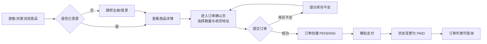

# Mall-Consistency-Lab 产品需求文档（PRD v1.0 / v1.2 / v1.3 增量；原名 Mall-Learning）

## 1. 背景与目标

### 1.1 项目背景

Mall-Consistency-Lab（原名 Mall-Learning）是一个用于简历展示的个人电商学习项目，通过实现一个覆盖用户、商品、订单三个核心域的微型电商系统，展示微服务架构、前后端分离、契约驱动开发等工程实践。

### 1.2 项目目标

- 提供一个可运行、可演示的完整电商闭环：注册 → 浏览 → 下单 → 支付 → 订单查询。
- 提供 B 端管理后台，支持商品的增删改查。
- 展示合理的架构分层与模块边界，便于评审人快速理解技术选型与实现思路。

## 2. 用户角色

| 角色 | 说明 | 核心操作 |
|---|---|---|
| 游客 | 未登录用户 | 浏览商品列表、查看商品详情 |
| 买家（C 端） | 已注册并登录的用户 | 注册登录、浏览商品、提交订单、模拟支付、查看订单列表与详情 |
| 管理员（B 端） | 商城运营人员 | 商品的新增、编辑、删除、上下架管理 |

> v1.0 曾简化为不区分角色权限；自 v1.2 起，网关对 `/api/v1/admin/**` 与商品写接口（POST/PUT/DELETE `/api/v1/products/**`）强制 ADMIN 角色，普通用户返回 403。仍不做细粒度 RBAC，详见「范围界定」。

## 3. 核心业务流程

### 3.1 C 端购买流程

### 3.2 B 端商品管理流程

管理员通过 Element Plus 后台对商品进行搜索、分页浏览、按分类筛选，并可新增、编辑或删除商品（删除需二次确认）。商品修改后缓存主动失效。

## 4. 功能需求

### 4.1 用户模块（mall-user）

#### FR-USER-01 用户注册

- **用户故事**：作为访客，我希望用用户名和密码注册账号，以便使用商城的完整功能。
- **接口**：`POST /api/v1/auth/register`
- **验收标准**：
  - 用户名唯一，重复注册返回错误提示。
  - 密码以 BCrypt 哈希存储，数据库中不出现明文。

#### FR-USER-02 用户登录

- **用户故事**：作为已注册用户，我希望输入用户名和密码获取令牌，以便访问需要鉴权的页面和接口。
- **接口**：`POST /api/v1/auth/login`
- **验收标准**：
  - 登录成功返回 `{token, userId, username, role}`。
  - Token 由网关统一校验，校验失败返回 401。

#### FR-USER-03 当前用户信息

- **接口**：`GET /api/v1/auth/me`
- **验收标准**：携带有效 Token 时返回当前用户基本信息；Token 无效返回 401。

### 4.2 商品模块（mall-product）

#### FR-PRODUCT-01 商品列表（C 端公开）

- **用户故事**：作为买家，我希望按分类筛选或关键词搜索商品，以便快速找到想买的商品。
- **接口**：`GET /api/v1/products?page=&size=&categoryId=&keyword=`
- **验收标准**：
  - 支持分页、分类筛选、关键词模糊搜索。
  - 无需登录即可访问。

#### FR-PRODUCT-02 商品详情（C 端公开）

- **接口**：`GET /api/v1/products/{productId}`
- **验收标准**：
  - 返回名称、价格、库存、图片等完整字段。
  - 结果经 Redis 缓存（TTL 10 分钟），商品修改/删除后缓存失效。

#### FR-PRODUCT-03 商品管理（B 端）

- **用户故事**：作为管理员，我希望新增、编辑、删除商品，以便维护商城的商品目录。
- **接口**：`POST/PUT/DELETE /api/v1/products...`
- **验收标准**：
  - 新增/编辑表单包含必填项校验。
  - 删除前弹出二次确认框。
  - 库存扣减采用乐观锁 + 幂等控制（幂等键为 orderNo）。

### 4.3 订单模块（mall-order）

#### FR-ORDER-01 提交订单

- **用户故事**：作为买家，我希望选择商品和数量后提交订单，以便完成购买。
- **前置条件**：已登录；商品存在且上架。
- **主流程**：确认页选择数量与收货地址 → 点击提交 → 后端校验并扣减库存 → 创建订单 → 返回 orderNo。
- **异常分支**：
  - 库存不足 → 返回 HTTP 409，前端提示「库存不足」。
  - Token 过期/无效 → 返回 401，前端清除本地 Token 并跳转登录页。
  - 重复点击提交按钮 → 前端防抖 + 后端以 orderNo 幂等。
- **接口**：`POST /api/v1/orders`（请求体仅含 productId 与 count，userId 从网关注入的 X-User-Id 头获取）。
- **验收标准**：给定 stock=5 的商品请求 count=6 时，返回 HTTP 409 且前端可见库存不足提示。

#### FR-ORDER-02 查询订单

- **用户故事**：作为买家，我希望查看我的历史订单列表和单笔详情，以便跟踪购物记录。
- **接口**：`GET /api/v1/orders?page=&size=` 和 `GET /api/v1/orders/{orderNo}`
- **验收标准**：
  - 仅能查看本人订单。
  - 列表支持分页。
  - 对外标识一律使用 orderNo，不暴露数据库自增主键。

#### FR-ORDER-03 模拟支付

- **用户故事**：作为买家，我希望支付已创建的订单，以便完成交易流程。
- **接口**：`POST /api/v1/orders/{orderNo}/pay`
- **验收标准**：
  - 仅 status=PENDING 的订单可支付，否则返回 409。
  - 支付成功后订单状态变为 PAID，订单列表即时反映变更。

> **v1.2 增量**：v1.1 补齐角色与幂等加固后，v1.2 聚焦补全 C 端「我的」与 B 端运营闭环。

### 4.4 用户模块增量（v1.2）

#### FR-USER-04 个人资料
- **接口**：`GET/PUT /api/v1/users/me`
- **验收标准**：
  - 返回 username/phone/email/avatar/role/createdAt；用户名不可修改。
  - 仅更新传入字段；传空字符串视为清除该字段。

#### FR-USER-05 修改密码
- **接口**：`PUT /api/v1/users/me/password`
- **验收标准**：旧密码校验失败返回 409；新密码与当前相同返回 409；成功后旧密码立即失效。

#### FR-USER-06 收货地址簿
- **接口**：`GET/POST /api/v1/users/me/addresses`、`PUT/DELETE /api/v1/users/me/addresses/{id}`
- **验收标准**：仅能操作本人地址；首条地址自动设为默认；设默认时同用户其余地址互斥清零；删除被引用地址不影响历史订单（订单存快照）。

### 4.5 订单模块增量（v1.2）

#### FR-ORDER-04 取消订单
- **接口**：`POST /api/v1/orders/{orderNo}/cancel`
- **验收标准**：仅 PENDING 可取消，否则 409(40002)；先 CAS 落 CANCELLED 再经幂等补偿接口回补库存（只回补一次）；回补失败不中止取消，由对账任务按「订单已取消」兜底回补（v1.4 修订，原「回补失败中止取消」顺序存在并发支付竞态，见 docs/DECISIONS.md）。

#### FR-ADMIN-01 订单管理（B 端）
- **接口**：`GET /api/v1/admin/orders`、`GET /api/v1/admin/orders/{orderNo}`、`POST /api/v1/admin/orders/{orderNo}/ship`
- **验收标准**：全量分页支持状态筛选与订单号模糊搜索；详情含商品明细 items；发货仅 PAID→SHIPPED；`/api/v1/admin/**` 由网关强制 ADMIN，普通 USER 访问返回 403。

#### FR-ADMIN-02 运营看板（B 端）
- **接口**：`GET /api/v1/admin/stats/orders`、`GET /api/v1/admin/stats/products`
- **验收标准**：今日/累计订单数与 GMV（不含已取消）、待发货数、低库存数；近 7 日趋势按日聚合补零。

#### FR-ADMIN-03 分类管理（B 端）
- **接口**：`GET /api/v1/categories`（公开）、`POST/PUT/DELETE /api/v1/admin/categories`
- **验收标准**：分类名唯一；删除仍被商品引用的分类返回 409 并提示数量。

### 4.6 下单地址快照机制（v1.2 设计决策）

订单表冗余 `receiver_name/receiver_phone/receiver_address` 快照列，下单时由 mall-order 经 Feign 内部接口 `GET /internal/users/{userId}/addresses/{addressId}` 取得并固化。跨库不做 join，地址后续修改/删除不影响历史订单展示。

### 4.7 订单明细图片快照（v1.3 增量）

order_item 冗余 `image_url` 列：下单时固化商品图片，商家后续改图不影响历史订单展示；存量数据由 `zz-migration-v1.3.sql` 按 product_id 从 mall_product 回填一次（脚本幂等可重复执行）。

## 5. 非功能需求

| 类别 | 要求 |
|---|---|
| 安全 | JWT 鉴权由网关统一处理；密码 BCrypt 存储；敏感配置通过环境变量注入，禁止硬编码 |
| 性能 | 单次接口响应 < 500ms（本地环境）；商品详情走 Redis 缓存降低数据库压力 |
| 可靠性 | 库存扣减具备幂等性，防止重复下单导致超卖或多扣 |
| 可维护性 | 所有 API 以 OpenAPI 3.0.3 契约先行，前后端共享 TypeScript 类型与契约逐字段对齐 |
| 兼容性 | C 端适配移动端视口（Vant 4）；B 端适配桌面端 |

## 6. 数据模型概要

| 实体 | 关键字段 | 关系 |
|---|---|---|
| User | id, username, password_hash, phone, email, avatar, status, role(USER/ADMIN) | 一名用户拥有多笔订单与多条地址 |
| Address | id, user_id, receiver, phone, province/city/district/detail, is_default | 属于一名用户；下单时被固化为收货快照 |
| Category | id, name | 一个分类下有多个商品 |
| Product | id, name, price, stock, category_id, version, status | 属于一个分类；被多个订单条目引用 |
| StockDedupLog | order_no(唯一), product_id, count, status(DEDUCTED/RESTORED) | 库存扣减幂等日志，以 orderNo 为幂等键，补偿只回补一次 |
| Order | id, order_no, user_id, total_amount, status, address_id, receiver_name/receiver_phone/receiver_address(快照) | 属于一名用户；包含多个订单条目 |
| OrderItem | id, order_id, product_id, product_name, price, count, image_url(快照) | 属于一笔订单；关联一件商品 |

> 详细的建表语句见 `docs/sql/*-schema.sql`，旧数据卷升级见 `zz-migration-v1.1~v1.3.sql`（均幂等可重复执行）。

## 7. 范围界定

### 本期包含（MVP）

- 用户注册/登录/当前用户信息
- 商品列表/详情/增删改查（含搜索、分页、分类筛选）
- 订单创建/查询/模拟支付
- Redis 缓存商品详情
- JWT 网关鉴权
- Docker Compose 一键部署
- CI 流水线（编译、测试、镜像构建）

### v1.2 追加包含

- C 端「我的」：个人资料查看/修改、修改密码、收货地址簿
- 订单取消（幂等回补库存）与收货人快照
- B 端：订单管理（查询/详情/发货）、数据看板、分类管理；`/api/v1/admin/**` 网关强制 ADMIN

### v1.3 追加包含

- 订单明细图片快照：order_item.image_url 下单固化，历史订单不受商家改图影响（含存量回填）

### 明确排除（Out of Scope）

| 功能 | 说明 |
|---|---|
| 购物车 | 不做，直接从商品详情进入订单确认页 |
| 优惠券/营销 | 不做 |
| 物流单号 | 不记录真实运单号；状态流转 PAID→SHIPPED（B 端发货）→COMPLETED（C 端确认收货或超时自动完成） |
| 收货地址 | ~~v1.0 为前端静态数组~~ → v1.2 已升级为真实地址服务；仅排除「省市区三级联动选择器」（当前为文本输入） |
| 角色权限体系 | ~~v1.0 B 端无权限校验~~ → v1.2 起网关对 `/api/v1/admin/**` 强制 ADMIN；仍不做细粒度权限/RBAC |
| 真实支付网关 | 仅提供模拟支付接口 |
| 分布式事务 | 库存扣减仅用乐观锁 + 幂等键保障，不引入 Seata 等 |
| 文件上传/OSS | 头像与商品图均为 URL 字符串 |
| PENDING 超时自动关单 | 不做；PENDING 订单需用户手动支付或取消。现有定时任务仅两个：SHIPPED 超时自动完成（OrderAutoCompleteTask）与孤儿扣减对账补偿（OrphanDeductionReconcileJob），详见 CONSISTENCY.md |

## 8. 术语表

| 术语 | 定义 |
|---|---|
| Result\<T\> | 统一响应包装结构：`{ code, message, data }`，成功时 code=0 |
| orderNo | 订单对外唯一标识（字符串），替代数据库自增主键对外暴露 |
| 幂等键 | 用于识别同一笔操作的唯一标识，本项目中指 orderNo 在库存扣减场景中的复用 |
| 乐观锁 | 通过版本号字段在更新时检测并发冲突的策略 |
| 契约先行 | 先定义 OpenAPI YAML 接口规范，再据此实现前后端代码的开发模式 |
